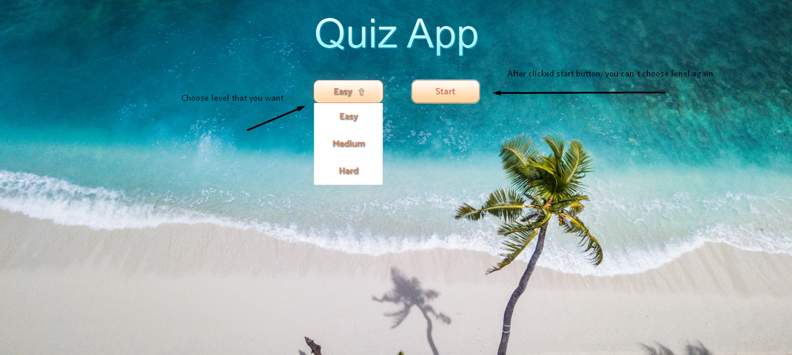
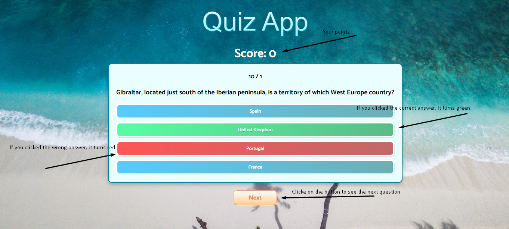
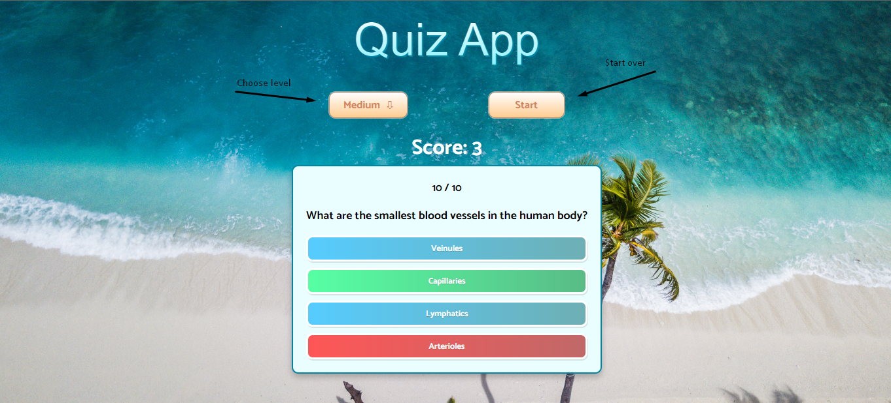

# Quiz App

A simple game consisting of 10 questions (any questions) with three difficulty levels(With Open Trivia DB).

---

## Built With

**Client:** React, TS, styled-components.

**API:** [Open Trivia DB](https://opentdb.com/)

## Features

- 10 questions from different topics.
- 3 levels of difficulty.
- Scores.

## Demo

[Demo](https://quiz-app-nine-sable.vercel.app/)

## How To Use

### Main Page

- Main page where you choose the difficulty level and you can start the game. After Game started you can`t choose level again.



- If you clicked wrong answer, it turns red. If you clicked correct answer, it turns green. And also you can see your points.



- When you answer the last question, you will start the game again. You can select the level again and start the game.



## Getting Started

### Installation

1. To run a project locally, first clone the repo

   ```sh
   git clone https://github.com/sapar6ek0v/quiz-app.git
   ```

2. Go to the project directory

   ```sh
   cd quiz-app
   ```

3. Install all packages

   ```sh
   npm install
   ```

4. Run the project

   ```sh
   npm start
   ```

## Feedback

If you have any feedback, please reach out to me at eldiiarsparbekov03@gmail.com
